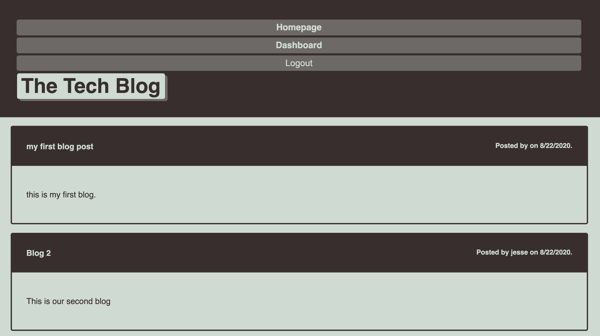
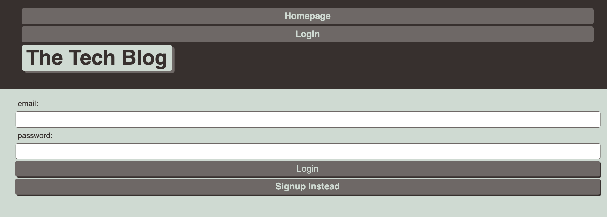
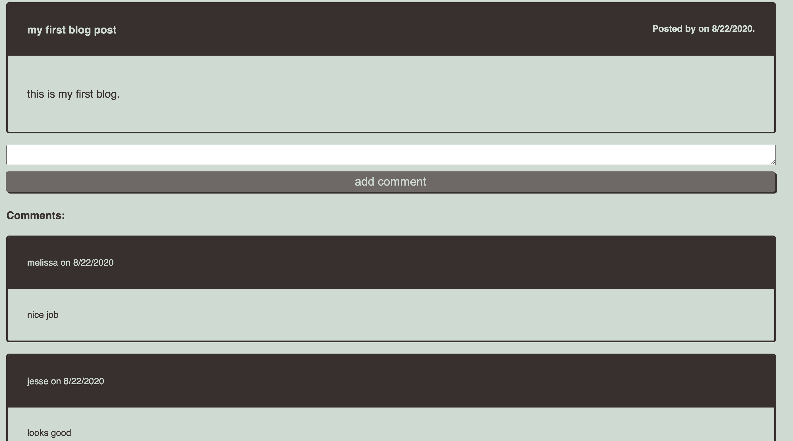
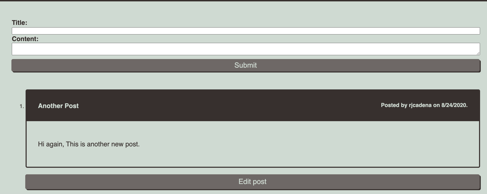

# Just Tech Blog

## Description: 

This application was built to allow users to blog about anything tech related. Upon page load, the user may read see a list of any current blog posts that have been saved to the site. Users my create a secure login on the site. Once they have done so, they will have the capability to see their own dashboard and to create, edit, and comment on their own posts. By clicking any of these links, the user is able to read the blog and the comments that have been left on the blog. By clicking on the Dashboard link in the navigation, the user is able to see all of their own published blogs. From here, they have the ability to edit or delete their blogs. 

## Table of Contents
* [Built With](#builtwith)
* [Screenshots](#screenshots)
* [Contributing](#contributing)
* [Questions](#questions)

## Built With
* MySQL
* Sequelize
* dotenv
* bcrypt
* Handlebars.js
* JawsDB

## Screenshots

* Homepage View
Shows all posts

* Login Page 
Also has option to sign up instead

* Single Post View
When clicking on a post, you'll be routed to this view. In ths view, you can see and add comments to the post.

* Dashboard View
When logged in, you can view your dashboard that shows your posts. Here you have the ability to edit your posts and add comments.

